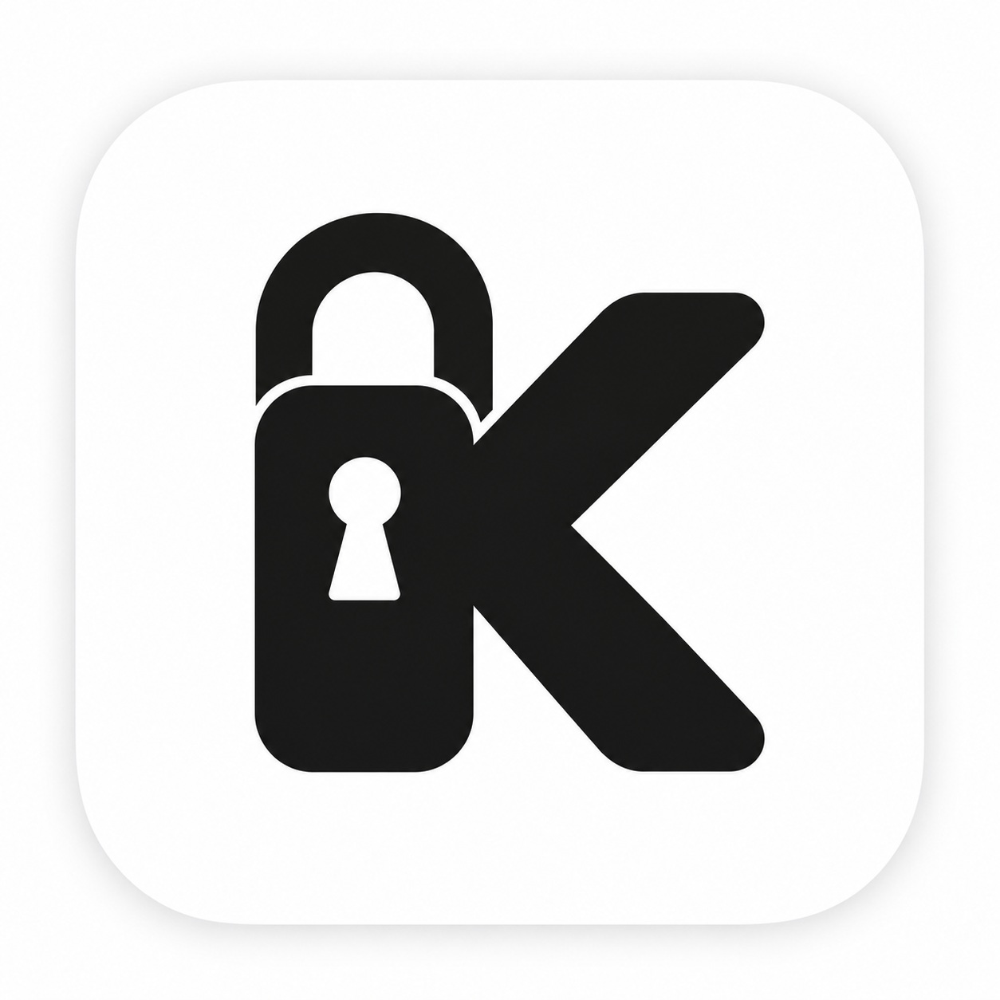

  

<h1 align="center">Kansolendar</h1>

  A private, offline-first calendar for macOS.

Kansolendar is a native calendar application designed to keep your schedule on your Mac. It does not require an account, cloud service, subscription, analytics system, or internet connection.

Your calendars and events are stored in a local encrypted vault. Access to its encryption key is protected by macOS Keychain and can be authorized with Touch ID or your Mac password.

## Features

- Day, week, month, and year calendar views
- Create, edit, move, and delete events
- Multiple calendars with custom colors
- All-day and scheduled events
- Light and dark appearance modes
- Custom accent colors
- Local search
- Encrypted backups and recovery kits
- Safe backup restoration
- Local iCalendar (`.ics`) import and export
- No accounts, advertising, analytics, or network access

## Privacy

Kansolendar is built around local ownership of calendar data:

- Event details are encrypted before being written to SQLite.
- The encryption key is stored in the macOS Data Protection Keychain.
- Unlocking requires local user authentication.
- Backups contain encrypted data and require a separate recovery kit.
- The application has no client or server network entitlement.

An exported `.ics` file is intentionally unencrypted and should be handled like any other document containing personal information.

## Requirements

- macOS 14 or later
- Apple Silicon Mac
- Touch ID or the Mac login password for protected vault access

## Installation

Download the latest `.dmg`, open it, and drag `Kansolendar.app` into the Applications folder.

Current development builds are distributed without Apple notarization. macOS may require approving the application from **System Settings → Privacy & Security → Open Anyway** after the first launch.

## Technology

Kansolendar is built with Swift 6, SwiftUI, CryptoKit, the macOS Security framework, and system SQLite. It has no remote package dependencies.

## Status

Kansolendar 1.0 currently supports Apple Silicon. Distribution is manual and updates do not contact a server automatically.
